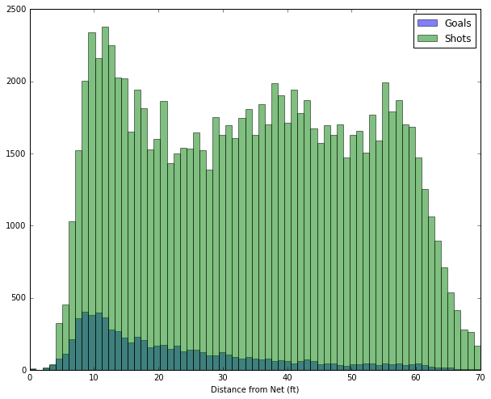
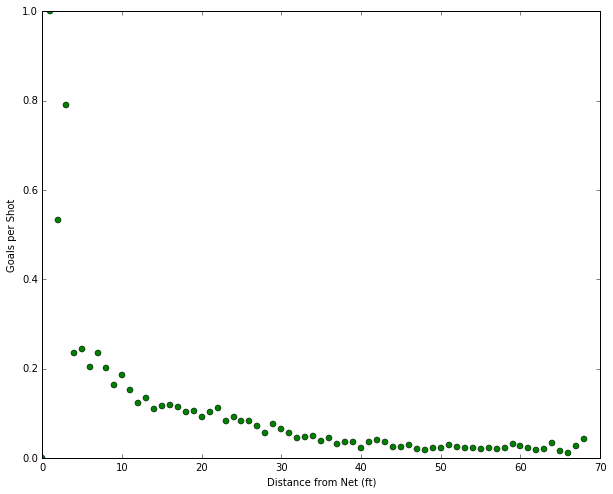

## Play-by-Play Data Example 

This notebook documents some goal and shot analysis of the NHL 2014/2015 season. The data was scraped using Python and BeautifulSoup.

For the analysis `Pandas` and `Matplotlib` were used. The `nhl_search` module includes database objects and helper functions to move through the data.


```python
%matplotlib inline
import nhl_search
import numpy as np
import pandas as pd
import matplotlib.pyplot as plt
import nhl_dictionaries as dicts
plt.rcParams['figure.figsize'] = (10.0, 8.0)
```

To start we initialize the databases. The `NHLSearch` object contains all the data from the game and player databases. By default it will assume the data bases: `gameDataBase.csv` and `playerDataBase.csv` are located in the current directory. However the user may specify their own databases during initialization.


```python
nhl_data = nhl_search.NHLSearch()
### Access game database
gameDataBase = nhl_data.gameDB

print gameDataBase.head()
```

                   Away  Away On Net  Away Score  Away Shots  Corsi        Date  \
    ID                                                                            
    20141008MTLTOR  MTL           28           4          54      0  2014/10/08   
    20141008PHIBOS  PHI           19           1          43    -13  2014/10/08   
    20141008VANCGY  VAN           29           4          46      3  2014/10/08   
    20141008S.JL.A  S.J           26           4          54    -14  2014/10/08   
    20141009COLBUF  COL            0           3           0    -38  2014/10/09   
    
                   Home  Home On Net  Home Score  Home Shots Season  
    ID                                                               
    20141008MTLTOR  TOR           34           3          54  14/15  
    20141008PHIBOS  BOS           41           2          56  14/15  
    20141008VANCGY  CGY           30           2          43  14/15  
    20141008S.JL.A  L.A           53           0          68  14/15  
    20141009COLBUF  BUF           32           1          38  14/15  


Both data bases are contained in the `Pandas` dataframe container. One must become familiar with this data object in order to successfully perform a search. In this simple example I'll search for all the games in the 14/15 season. The result of the search are the unique `ID`s of each game which are set as the `index` of each entry of the dataframe.


```python
seasonGames = gameDataBase.loc[gameDataBase.Season=='14/15']
gameIDs = seasonGames.index
```

With the `ID`s we can mutate each of them into a `Game` object using the `GetGames` method. This outputs a list containing `Game` objects. Each game object contains the following attributes: `playbyplay`, `date`, `away`, `home`, `awayscore`, `homescore` as well as the team rosters in `awayteam` and `hometeam`.


```python
games = nhl_search.GetGames(gameIDs)
```

Now our objective is to collect distance and shot types from each game and compile it into one dataframe. 


```python
## Define an analysis function
def ShotAnalysis(game):
    #Get play by play data from game object
    df = game.playbyplay
    #Subset for shots on net, misses and goals.
    df_shots = df.loc[(df.Event =='1') | (df.Event == '2')| (df.Event =='7'),['Event','slot1','slot2']]
    return df_shots

## concatenate into one dataframe and rename the columns
shotdata = pd.concat(map(ShotAnalysis,games))
shotdata.columns = ['Event','Distance','Shot'] 

##Use the dictionaries to translate the data:
shotdata.Event = [dicts.inv_events[i] for i in shotdata.Event]
shotdata.Shot = [dicts.inv_shotTypes[i] for i in shotdata.Shot]

print shotdata.head()
```

                 Event Distance      Shot
    Event Number                         
    3             MISS       41     Wrist
    5             SHOT       46  Backhand
    10            SHOT       59     Wrist
    11            MISS       19      Snap
    18            MISS       60     Wrist


With this data let's take a look into shooting distance.


```python
## Filter data for shots less than 100 ft 
shotdata.Distance = map(float,shotdata.Distance)
shots = shotdata.loc[(shotdata.Distance < 70)&((shotdata.Event=='SHOT')|(shotdata.Event=='MISS')),]
goals = shotdata.loc[(shotdata.Distance < 70)&(shotdata.Event=='GOAL'),]

##make histograms
bins = np.linspace(0,70,70)

plt.hist(goals.Distance,bins,alpha=0.5,label='Goals')
plt.hist(shots.Distance,bins,alpha=0.5,label='Shots')
plt.xlabel('Distance from Net (ft)')
plt.legend(loc='upper right')
plt.show()

```





```python
ghist,gedges = np.histogram(goals.Distance,bins)
shist,sedges = np.histogram(shots.Distance,bins)
plt.plot(np.divide(map(float,ghist),map(float,shist)),'go')
plt.ylabel('Goals per Shot')
plt.xlabel('Distance from Net (ft)')
plt.show()
```





#### Accessing Player Dictionary

We can also cross-link the game database to the participating players. For example we can peer into each game that Sidney Crosby played in via the player dictionary that is contained in the `NHLSearch` object.


```python
### Access player dictionary
playerDict = nhl_data.playerDB

##Lookup Sidney Crosby game IDs
SC_games = playerDict['SIDNEY CROSBY']

##Print some IDs
print SC_games[:25]

```

    ['20141009ANAPIT', '20141011PITTOR', '20141016DALPIT', '20141018NYIPIT', '20141022PHIPIT', '20141023PITDET', '20141025PITNSH', '20141028N.JPIT', '20141030L.APIT', '20141101BUFPIT', '20141104PITMIN', '20141106PITWPG', '20141108PITBUF', '20141111PITNYR', '20141114PITTOR', '20141115NYRPIT', '20141118PITMTL', '20141121NYIPIT', '20141122PITNYI', '20141124PITBOS', '20141126TORPIT', '20141128CARPIT', '20141129PITCAR', '20141202N.JPIT', '20141204VANPIT']

